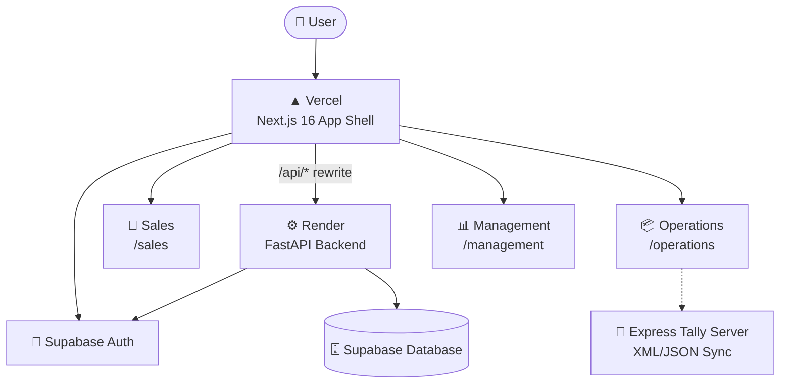

<div align="center">

# 🏢 Business Ops Platform

### One repository. One deployment. One login. Three workspaces.

A consolidated enterprise operations platform that unifies **sales**, **inventory** and **business intelligence** into a single role-based application.

<br/>

[](https://business-ops-platform-rosy.vercel.app)

<br/>


</div>

---

## 📑 Table of Contents

- [✨ Overview](#-overview)
- [🧩 Workspaces](#-workspaces)
- [🏗️ Architecture](#️-architecture)
- [📁 Project Structure](#-project-structure)
- [🚀 Getting Started](#-getting-started)
- [🔌 API Proxy & Routes](#-api-proxy--routes)
- [☁️ Deployment](#️-deployment)
- [🔐 Security Model](#-security-model)
- [🧾 Tally ERP Integration](#-tally-erp-integration)
- [🛠️ Troubleshooting](#️-troubleshooting)

---

## ✨ Overview

**Business Ops Platform** merges three standalone business applications into one codebase:

| | |
|---|---|
| 🔑 **Single login** | Supabase Auth, one sign-in for every workspace |
| 🧭 **Role-based workspaces** | Users land in the workspace their role allows |
| 📦 **One repo, one deploy** | A single Next.js 16 shell hosts everything |
| 🛡️ **Preservation first** | Original UI, charts, forms and database logic are kept intact |

---

## 🧩 Workspaces

| Workspace | Route | Origin | What it does |
|:--|:--|:--|:--|
| 🛒 **Sales** | `/sales` | Order App | Sales rep portal, dealer/customer selection, catalog search, order creation and submission, PDF generation, CSV import/export, offline order queueing |
| 📦 **Operations** | `/operations` | Stock App | Inventory balances, pending-order approval lifecycle, restock planner, stock movements (In, Out, Adjustments, Returns), Tally ERP sync |
| 📊 **Management** | `/management` | BI App | Executive BI dashboards, geographic GIS heatmaps, financial valuation, demand forecasting, stock reconciliation, report exports |

---

## 🏗️ Architecture



The browser only ever talks to the Vercel origin. Next.js rewrites every `/api/*` request to the FastAPI backend, so there are no CORS or cross-site cookie headaches.

---

## 📁 Project Structure

```text
business-ops-platform/
│
├── app/                    # Next.js 16 App Router shell
│   ├── page.tsx            #   Landing page & workspace switcher
│   ├── login/              #   Unified login
│   ├── sales/              #   Sales workspace route
│   ├── operations/         #   Operations workspace route
│   ├── management/         #   Management workspace route
│   ├── globals.css         #   Global styles & Tailwind CSS v4
│   └── layout.tsx          #   Root layout & platform navigation
│
├── workspaces/             # Preserved source of each original app
│   ├── sales/
│   ├── operations/
│   └── management/
│
├── backend/                # Python FastAPI (orders, inventory, RBAC)
├── server/                 # Express server & Tally sync engine
├── shared/                 # Shared header, navigation, auth helpers, API client
├── public/                 # Static assets (logos, icons)
├── docs/                   # Additional documentation
├── middleware.ts           # Route protection for workspace pages
├── next.config.ts          # Config & /api proxy rewrites
└── package.json
```

---

## 🚀 Getting Started

### 📋 Prerequisites

| Tool | Version |
|:--|:--|
| 🟢 Node.js | 18+ or 20+ |
| 📦 npm | 9+ |
| 🐍 Python | 3.10+ |

### 1️⃣ Clone and configure

```bash
git clone https://github.com/dheeraj-srma/Business-Ops-Platform.git
cd Business-Ops-Platform
cp .env.example .env
```

Fill in your own values in `.env`:

```env
NEXT_PUBLIC_SUPABASE_URL=https://<your-project>.supabase.co
NEXT_PUBLIC_SUPABASE_PUBLISHABLE_KEY=<your-publishable-key>
SUPABASE_URL=https://<your-project>.supabase.co
SUPABASE_ANON_KEY=<your-publishable-key>
NEXT_PUBLIC_API_URL=http://127.0.0.1:8000
```

### 2️⃣ Install dependencies

```bash
npm install
```

### 3️⃣ Run the dev servers

| Service | Command |
|:--|:--|
| 🖥️ Frontend (Next.js) | `npm run dev` |
| ⚙️ FastAPI backend (port 8000) | `npm run dev:backend` |
| 🧾 Express Tally server | `npm run dev:tally` |

### 4️⃣ Production build check

```bash
npm run build
npm run start
```

---

## 🔌 API Proxy & Routes

`next.config.ts` forwards all API traffic to the backend:

```ts
const BACKEND_URL =
  process.env.BACKEND_API_URL || "https://business-ops-platform-api.onrender.com";

async rewrites() {
  return [
    {
      source: "/api/:path*",
      destination: `${BACKEND_URL.replace(/\/+$/, "")}/api/:path*`,
    },
  ];
}
```

| Method | Frontend path | Backend path | Purpose |
|:--:|:--|:--|:--|
| `GET` | `/api/auth/me` | `/api/auth/me` | Current session (401 when signed out) |
| `POST` | `/api/auth/login` | `/api/auth/login` | Sign in |
| `POST` | `/api/auth/logout` | `/api/auth/logout` | Sign out |
| `GET` | *(root, not proxied)* | `/healthz` | Backend health check |

---

## ☁️ Deployment

| Layer | Host | Notes |
|:--|:--|:--|
| 🖥️ Frontend | **Vercel** | Framework preset: Next.js, root directory: repo root |
| ⚙️ Backend | **Render** | FastAPI service, health check at `/healthz` |
| 🔑 Auth & data | **Supabase** | Auth and Postgres |

### Vercel environment variables

| Key | Value |
|:--|:--|
| `BACKEND_API_URL` | Backend **origin only**, e.g. `https://business-ops-platform-api.onrender.com` (no trailing `/` or `/api`) |
| `NEXT_PUBLIC_SUPABASE_URL` | Your Supabase project URL |
| `NEXT_PUBLIC_SUPABASE_PUBLISHABLE_KEY` | Your Supabase publishable key |

> 💡 Environment variable changes only apply to **new** deployments. Redeploy after changing them.

### ✅ Verify a deployment

```bash
# Backend is alive
curl -i https://business-ops-platform-api.onrender.com/healthz

# Proxy works: expect 401 with a JSON body from FastAPI
curl -i https://<your-production-domain>/api/auth/me
```

---

## 🔐 Security Model

- 🛡️ **Authentication is enforced on the backend** through Supabase Auth and FastAPI JWT verification.
- 🧭 **Frontend role checks are UX only.** They drive workspace navigation, not access control.
- 🔒 **No private keys in source.** Service-role keys and secrets are never committed. Only publishable keys belong in client-side env vars.

---

## 🧾 Tally ERP Integration

The Tally synchronization subsystem lives in `server/tally` and is fully preserved from the original Stock App:

- 🔄 XML/JSON synchronization engine
- 🗺️ Mappers and parsers
- 📮 Dead-letter queue semantics for failed syncs

---

## 🛠️ Troubleshooting

<details>
<summary><b>🔴 <code>/api/auth/*</code> returns 404 on Vercel</b></summary>

<br/>

- Test on your **production domain**, not an old deployment-specific URL. Those are immutable snapshots and are protected by Vercel login.
- Confirm `BACKEND_API_URL` is the origin only, with no `/api` suffix.
- Do **not** add a `vercel.json` with an `/index.html` fallback. This is a Next.js app, not a static SPA.
- Redeploy after changing `next.config.ts` or environment variables.
- Read the response: FastAPI's 401 body contains `Authentication token required.`. A 404 with `x-vercel-error: NOT_FOUND` points to project settings.

</details>

<details>
<summary><b>🐢 First request is slow or times out</b></summary>

<br/>

On Render's free tier the backend sleeps after inactivity and can take 30–60 seconds to wake. Retry, or hit `/healthz` first.

</details>

---

<div align="center">

**Built with ❤️ by [@dheeraj-srma](https://github.com/dheeraj-srma)**

⭐ Star this repo if you find it useful

</div>
