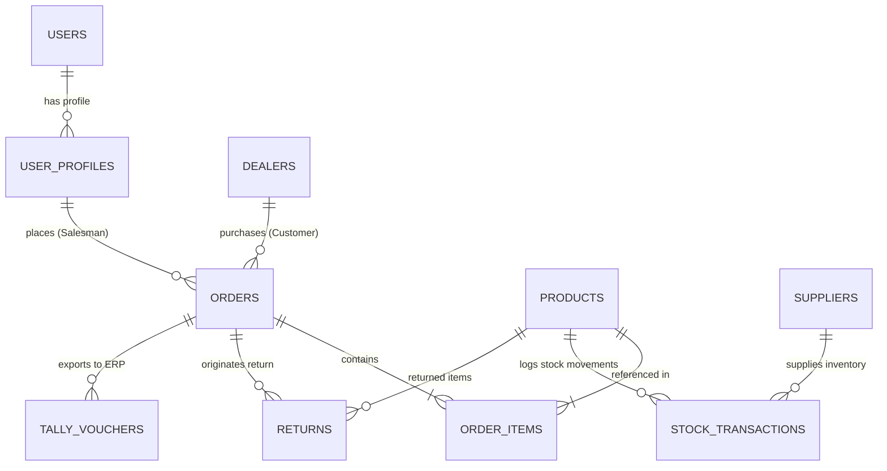

# Business Ops Platform — Phase 4 Backend Migration Architecture & Audit

**Document Status**: Active Implementation Blueprint  
**Target Repository**: `business-ops-platform`  
**Current Phase**: Phase 4 — Central Backend & Data Access Migration  

---

## 1. Audit of Existing Data Access Patterns

Before introducing centralized endpoints, every workspace's current data access mechanics have been audited and mapped below.

### A. Sales Workspace (`workspaces/sales`)
- **Primary Data Access Client**: Direct browser Supabase Client (`@supabase/supabase-js`) initialized in `src/lib/supabaseClient.ts`.
- **Database Tables Accessed**:
  - `public.products`: Catalog lookup, SKU search, pricing, stock display.
  - `public.dealers`: Customer selector, credit limits, regional customer lookup.
  - `public.pending_orders`: Order header submission and order history views.
  - `public.pending_order_items`: Order line item details.
  - `public.system_settings`: Platform flags (e.g. `allow_negative_orders`).
  - `public.user_profiles`: Sales representative profile and assigned state/region.
- **RPC / Stored Database Functions**:
  - `supabase.rpc('submit_order', { p_order: ..., p_items: ... })`: Atomic order submission function.
- **Realtime Subscriptions**:
  - `supabase.channel('public:system_settings')`: Live configuration updates.
  - `supabase.channel('public:products')`: Live inventory level changes.
- **Offline / Resilience Queue**:
  - `src/utils/offlineQueue.ts`: Queues pending order insertions in IndexedDB/localStorage when offline, flushing via `submit_order` or raw `pending_orders`/`pending_order_items` inserts upon reconnect.

### B. Operations Workspace (`workspaces/operations`)
- **Primary Data Access Client**: Express Node.js Server (`server/routes.ts`) + Client API (`src/lib/api.ts`).
- **Dual Data Access Pattern**:
  - Local JSON/File Storage (`server/data/`): Fallback transactional cache for high-speed stock adjustments and offline voucher creation.
  - Supabase Background Sync (`server/supabaseSyncService.ts`): Automatically pushes local stock adjustments and fetches pending orders from Supabase.
- **Database Tables Accessed**:
  - `public.products`: Stock adjustments, inventory status, product metadata.
  - `public.pending_orders` & `public.pending_order_items`: Incoming orders waiting for warehouse processing.
  - `public.stock_transactions`: Audit trail of stock-in, stock-out, and manual adjustments.
  - `public.returns`: Order return processing and stock restoration.
  - `public.suppliers`: Supplier purchase order tracking.
- **Tally ERP Integration**:
  - Express Server generates Tally XML Vouchers (`server/tallyService.ts`) and exposes endpoints on HTTP port 9000 for direct sync with Tally ERP 9 / Prime.

### C. Management Workspace (`workspaces/management`)
- **Primary Data Access Client**: Central FastAPI Backend (`http://127.0.0.1:8000/api/*`) proxy-routed via Next.js `app/api/[...path]/route.ts`.
- **Backend Service & Repository Layer**:
  - `backend/routers/analytics_router.py`: BI metrics, revenue trends, top customer performance.
  - `backend/routers/dashboard_router.py`: High-level executive KPI summaries.
  - `backend/routers/geography_router.py`: Heatmap data for Indian state-wise sales distribution.
  - `backend/routers/inventory_router.py`: Platform-wide inventory valuation and stock health reports.
  - `backend/routers/order_router.py`: Historical order search, filtering, and status breakdown.

---

## 2. Business Domain Map

Below is the authoritative mapping of business entities and their relationships within PostgreSQL / Supabase:



### Core Business Entities:
1. **Users & User Profiles** (`auth.users` / `public.user_profiles`):
   - Stores identity, email, full name, role (`admin`, `stock_manager`, `order_manager`, `salesman`, `viewer`), assigned region.
2. **Customers / Dealers** (`public.dealers`):
   - Stores dealer name, GSTIN, phone, state, city, credit limit, salesman assignment.
3. **Products / Items** (`public.products`):
   - Stores SKU, product name, category, price, current stock, minimum stock threshold, HSN code, unit of measurement.
4. **Orders & Line Items** (`public.pending_orders` / `public.pending_order_items`):
   - Stores order header (order number, dealer ID, salesman ID, total amount, status, timestamps) and line items (product ID, quantity, unit price, item total).
5. **Inventory & Stock Transactions** (`public.stock_transactions`):
   - Tracks stock adjustments (`in`, `out`, `adjustment`, `reservation`) with reference order ID, timestamp, and audit user ID.
6. **Returns** (`public.returns`):
   - Tracks returned merchandise, reason, order reference, stock disposition (`restock` vs `damaged`).
7. **Suppliers** (`public.suppliers`):
   - Vendor records for raw material and finished inventory procurement.
8. **Tally Synchronization** (`server/tallyService.ts`):
   - Tracks voucher export status (`pending`, `synced`, `error`) and XML payload history.

---

## 3. Central API Domain Architecture Target

```
                    Next.js Application Shell (/app)
                                 │
                   Shared API Client (shared/api/client.ts)
                                 │
                                 ▼
                     Central FastAPI Backend (/api/v1)
                                 │
       ┌─────────────────────────┼─────────────────────────┐
       ▼                         ▼                         ▼
   Products Router           Customers Router           Orders Router
(routers/product_router.py) (routers/customer_router.py) (routers/order_router.py)
       │                         │                         │
       ▼                         ▼                         ▼
   Products Service          Customers Service          Orders Service
(services/product_service.py) (services/customer_service.py) (services/order_service.py)
       │                         │                         │
       └─────────────────────────┼─────────────────────────┘
                                 │
                                 ▼
                     Repository & Database Layer
                    (repositories/ & Supabase/Postgres)
```

---

## 4. Domain Migration Strategy & Status

Migration is executed strictly domain-by-domain starting with low-risk read operations:

| Domain | Scope & Endpoints | Workspace Targets | Risk Level | Status |
|---|---|---|---|---|
| **0. Auth & Session** | `POST /api/auth/login`, `GET /api/auth/me`, `POST /api/auth/logout` | All Workspaces | Medium | **`CENTRALIZED`** (Phase 3) |
| **1. Products** | `GET /api/products`, `GET /api/products/{id}` | Sales, Operations | Low | **`CENTRALIZED`** (Phase 4) |
| **2. Customers** | `GET /api/customers`, `GET /api/customers/{id}` | Sales, Operations | Low | **`CENTRALIZED`** (Phase 4) |
| **3a. Inventory (Reads)** | `GET /api/inventory`, `GET /api/inventory/{id}` | Operations, Management | Medium | **`CENTRALIZED`** (Phase 5A) |
| **3b. Inventory (Manual Adjust)** | `POST /api/inventory/adjust` | Operations | High | **`CENTRALIZED`** (Phase 5C.3) |
| **3c. Inventory (Stock-In)** | `POST /api/inventory/stock-in` | Operations | High | **`CENTRALIZED`** (Phase 5C.4) |
| **3d. Inventory (Reservations)** | `POST /api/orders/reserve` | Sales | High | **`CENTRALIZED`** (Phase 5C.5) |
| **3e. Inventory (Returns)** | `POST /api/returns/restock` | Operations | High | **`CENTRALIZED`** (Phase 5C.6) |
| **3f. Inventory (Stock-Out / Processing)** | `POST /api/orders/{id}/process`, `POST /api/inventory/stock-out` | Operations | High | **`CENTRALIZED`** (Phase 5C.7) |
| **4a. Orders (Reads & History)** | `GET /api/orders`, `GET /api/orders/{id}` | Sales, Operations, Management | Medium | **`CENTRALIZED`** (Phase 6A) |
| **4b. Orders (Editing)** | `POST /api/orders/update` | Operations | High | **`LEGACY`** |
| **4c. Orders (Cancellation & Rejection)** | `POST /api/orders/reject`, `POST /api/orders/rollback-reject` | Operations | High | **`LEGACY`** |
| **5. Returns (Restocking)** | `GET /api/returns`, `POST /api/returns` | Operations, Management | Medium | **`CENTRALIZED`** (Phase 5C.6) |
| **6. Analytics** | `GET /api/analytics/*`, `GET /api/dashboard/*` | Management | Low | **`LEGACY`** |
| **7. Tally ERP** | Express Server `/api/tally/*` (Port 9000) | Operations | High | **`LEGACY / EXISTING SERVICE`** |

---

## 5. Shared API Client Structure (`shared/api/`)

To prevent duplicating fetch logic across workspaces, a unified, typed API client is being established:

```
shared/api/
├── client.ts         # Core fetch wrapper handling base URL, HttpOnly credentials, headers & error mapping
├── products.ts       # Products domain API methods (getProducts, getProductById)
├── customers.ts      # Customers domain API methods (getCustomers, getCustomerById)
├── inventory.ts      # Inventory domain API methods (getInventory, adjustStock)
└── orders.ts         # Orders domain API methods (getOrders, createOrder)
```

---

## 6. Safety & Verification Standards

1. **Zero Frontend Logic Rewrite**: UI components receive identical data shapes.
2. **Permission Guarding**: Every new API endpoint requires `@require_permission(...)` verification.
3. **Atomic Transactions**: All multi-table writes (such as order creation) execute inside DB transactions.
4. **Tally Non-Interference**: Express/Tally integration endpoints remain untouched and fully functional.
