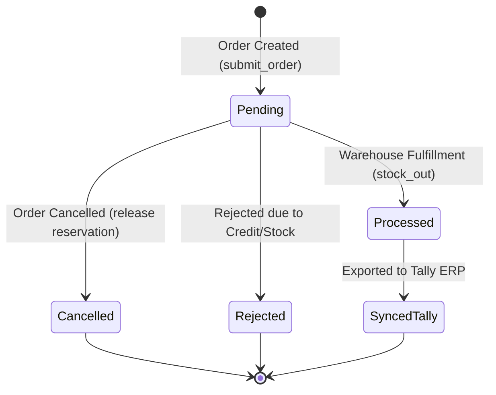

# Business Ops Platform — Inventory Business Rules & Operations Specification

**Phase Status**: Phase 5B Completed (Audit, Formal Specification & Transaction Model Design)  
**Target Repository**: `business-ops-platform`  
**Current Phase**: Phase 5B — Inventory Business Rules & Transaction Model  

---

## 1. Authoritative Stock Semantics & Column Resolution (Critical Precondition Audit)

Following an exhaustive codebase and database audit of legacy mutation functions (`admin_service.py`, `submit_order` RPC, `routes.ts`, and `inventory_repo.py`), the stock semantics are formally established as follows:

1. **Legacy Mutation Mechanics**:
   - **`quantity_available` Nature**: `quantity_available` is a **materialized database column** in `public.inventory` maintained directly by **application service logic** upon every stock mutation. There are NO database triggers or automatic column formulas operating silently in PostgreSQL.
   - **Stored vs. Derived**: `quantity_on_hand`, `quantity_reserved`, and `quantity_available` are all stored columns. Application services explicitly compute and set `quantity_available = quantity_on_hand - quantity_reserved` during writes.
   - **Priority Reads**: Queries read `public.inventory.quantity_available` directly. If `quantity_available` is `NULL`, the calculation $\text{quantity\_on\_hand} - \text{quantity\_reserved}$ is used as fallback.

2. **Legacy Adjustment Behavior on Columns**:
   - **`quantity_on_hand`**: Set directly to the new physical count $N$.
   - **`quantity_reserved`**: Remains unchanged ($R_{\text{existing}}$) as it reflects active pending orders.
   - **`quantity_available`**: Set to $N - R_{\text{existing}}$.

3. **Negative Stock Override Mechanics**:
   - Default Mode (`allow_negative_orders = false`): Mutations attempting to drop `quantity_available` below zero are blocked with `409 INSUFFICIENT_STOCK`.
   - Override Mode (`allow_negative_orders = true`): Permitted when enabled in `public.system_settings`, marking stock health status as `NEGATIVE`.

---

## 2. Stock Health Classification

Backend stock health classification is centrally defined as:

$$\text{status} = \begin{cases} 
\text{NEGATIVE} & \text{if } \text{physical\_stock} < 0 \\
\text{OUT\_OF\_STOCK} & \text{if } \text{physical\_stock} = 0 \\
\text{CRITICAL} & \text{if } 0 < \text{physical\_stock} \le 5 \\
\text{LOW} & \text{if } 5 < \text{physical\_stock} \le 15 \\
\text{HEALTHY} & \text{if } \text{physical\_stock} > 15 
\end{cases}$$

---

## 3. Inventory Mutation Audits

### A. Order Submission & Reservation (`submit_order`)
- **Trigger**: Salesman or Customer places an order via Sales Workspace or Offline Queue sync.
- **RPC / Function**: `public.submit_order(p_items, p_shop_name, ...)`
- **Mechanism**:
  1. Executes `SELECT * FROM public.inventory WHERE item_name = ... FOR UPDATE;` (Row-level pessimistic lock).
  2. Dynamically sums open reservations: `SELECT SUM(quantity) FROM public.pending_order_items WHERE item_name = ...`.
  3. Evaluates `v_available_stock = GREATEST(0, v_current_stock - v_reserved_stock)`.
  4. If `allow_negative_orders` system setting is `false` and requested quantity exceeds `v_available_stock`, rolls back atomically with `INSUFFICIENT_STOCK`.
  5. Inserts header into `pending_orders` (`status = 'Pending'`) and line items into `pending_order_items`.

### B. Order Processing & Fulfillment
- **Trigger**: Operations Manager approves/processes a pending order.
- **Mechanism**:
  1. Deducts item quantities from physical stock (`quantity_on_hand`).
  2. Releases reserved stock by transitioning order header status from `Pending` to `Processed`.
  3. Inserts negative stock movement into `stock_transactions` (`transaction_type = 'STOCK_OUT'`).

### C. Manual Stock Adjustment & Admin Re-Stock
- **Trigger**: Operations Admin manually adjusts stock via `/api/admin/inventory/adjust` or `/api/inventory/reconcile/fix`.
- **Mechanism**:
  1. Reads existing `quantity_on_hand` and `quantity_reserved`.
  2. Updates `quantity_on_hand` to `new_quantity` and `quantity_available` to `new_quantity - quantity_reserved`.
  3. Writes audit log event to `system_audit_logs`.

### D. Returns & Restocking (`create_return`)
- **Trigger**: Customer return processed via `/api/returns`.
- **Mechanism**:
  1. Creates return voucher record in `returns` table (`return_code = 'RET-XXXXXX'`).
  2. If return condition is `Good Return`, records positive movement in `stock_transactions` (`transaction_type = 'return_in'`), restoring physical stock balance.

### E. Tally ERP Synchronization (`tally_service.py` / Node port 9000)
- **Trigger**: Background batch sync or webhook event from Tally ERP 9 / Prime.
- **Mechanism**:
  1. Parses Tally XML Vouchers for Inventory Stock-In or Stock-Out.
  2. Matches master items by SKU or Tally Item Name.
  3. Inserts transaction record into `stock_transactions` (`transaction_type = 'STOCK_IN'` / `'STOCK_OUT'`).

---

## 4. Reservation Model & Lifecycle

- **Order Created (`Pending`)**: Reserves stock by adding items to `pending_order_items`.
- **Order Processed (`Processed`)**: Converts reservation to physical stock deduction (`STOCK_OUT`).
- **Order Cancelled / Rejected**: Deletes/updates `pending_orders` status, automatically releasing reserved quantity for future orders.

---

## 5. Concurrency & Idempotency Rules

1. **Row-Level Database Locking**:
   - Multi-item stock operations must lock row records (`FOR UPDATE`) to prevent race conditions during concurrent order placement or inventory adjustment.
2. **Idempotency Keys**:
   - Order submission uses `order_id` deduplication (`ORD-<salesman_id>-<timestamp>`).
   - Tally voucher imports utilize `tally_guid` to prevent duplicate transaction entries upon network retries.
3. **System Overrides**:
   - System setting `allow_negative_orders` controls whether orders can be accepted when `requested_quantity > available_stock`.

---

## 6. Granular Permission Mapping

| Business Operation | Required Permission | Allowed Roles |
|---|---|---|
| View Inventory & Catalog | `inventory.view` | `admin`, `stock_manager`, `order_manager`, `salesman`, `viewer` |
| Manual Stock Adjustment | `inventory.manage` | `admin`, `stock_manager` |
| Process Order Fulfillment | `orders.process` | `admin`, `stock_manager`, `order_manager` |
| Create Return / Restock | `returns.manage` | `admin`, `stock_manager`, `order_manager` |
| Reconcile Stock Ledger | `system.manage` | `admin` |
